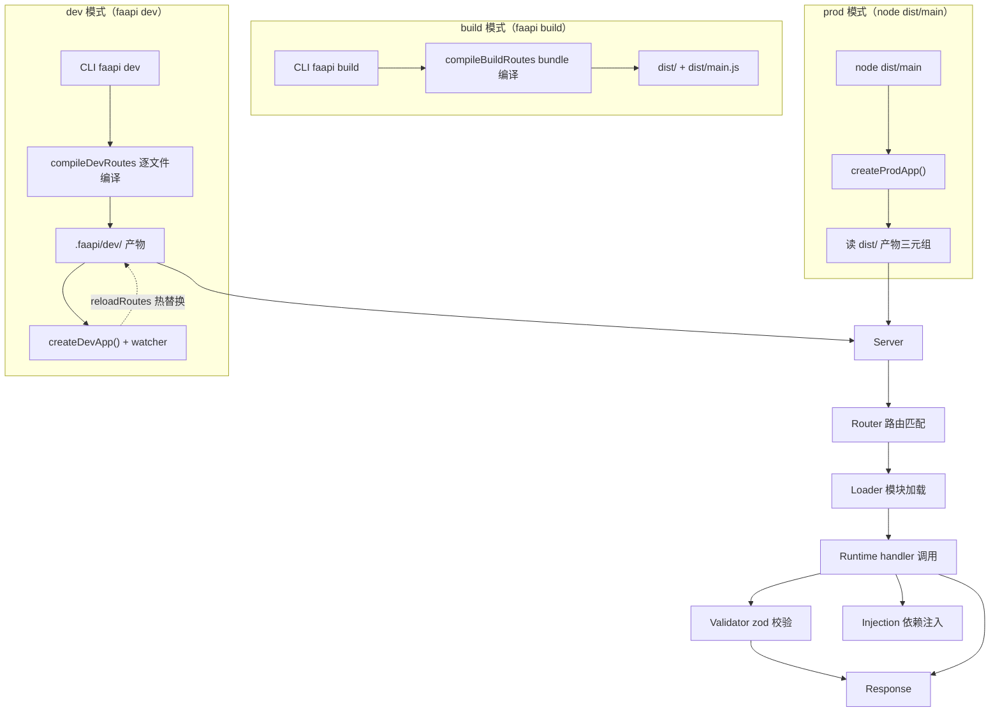

# faapi

> 函数即接口 — Function as API

faapi 是一个 Node.js 框架，核心理念是"函数即接口"。编写普通 TypeScript 函数即可暴露为 HTTP / WebSocket 接口，类型校验由 TypeScript AST 自动生成，无需手写 schema。

## 特性

- **函数即接口**：导出 `GET`/`POST` 等函数即声明路由，无需装饰器、无需手写 schema
- **AST 类型校验**：TypeScript Compiler API 分析接口参数类型，自动生成运行时校验函数
- **洋葱模型中间件**：单一 async 函数 `(ctx, next) => {}`，`await next()` 前后衔接前置/后置逻辑
- **依赖注入**：注入器（injector）按参数名匹配 handler 参数，与中间件解耦
- **WebSocket 路由**：导出 `WS` 函数即声明 WS 路由，握手阶段复用洋葱中间件鉴权
- **SSE 流式响应**：`ctx.sse()` 返回 `SseWriter`，适用于 LLM 流式输出、通知推送
- **动态路由**：`[id]` 动态参数、`[...slug]` catch-all、`(group)` 分组
- **MCP 集成**：LLM 可查询路由 schema
- **配置文件**：`faapi.config.ts` 支持统一响应格式、全局错误处理、生命周期钩子、全局中间件/注入器
- **ESM only**：原生 ES Modules，Node.js >= 24。faapi 仅支持 ESM（`type: "module"`），不提供 CJS 产物——AST 分析与 esbuild 编译链路依赖 ESM 的确定性模块解析，支持 CJS 会增加维护成本而不带来额外能力

## 架构



dev/prod 走完全一致的读产物代码路径（`createAppBase`），差异仅由 `FAAPI_DIST` 环境变量驱动，无 `if (isDev)` 控制流分支。产物三元组：`faapi-config.js`（配置）+ `faapi-routes.js`（路由清单）+ 各 handler 的 `zod.js`（schema 校验）。

## 快速开始

### 安装

```bash
pnpm add @faapi/faapi
# 或
npm install @faapi/faapi
```

### 创建第一个接口

```ts
// api/user/handler.ts
export interface Query {
  page: number;
  pageSize: number;
}

export interface CreateUserBody {
  name: string;
  email: string;
}

export function GET(query: Query) {
  return { page: query.page, pageSize: query.pageSize };
}

export function POST(body: CreateUserBody) {
  return { created: true, name: body.name };
}
```

### 启动开发服务器

```bash
faapi                      # 编译 src/ → .faapi/dev/，启动 dev server + watcher
```

访问 `http://localhost:3000/api/user?page=1&pageSize=10` 即可获取数据。

框架采用零入口设计——无需编写 `main.ts`：dev 由 CLI 内部编排，prod 由 `faapi build` 自动生成 `dist/main.js` 启动入口。自定义启动逻辑（初始化数据库等）通过 `faapi.config.ts` 的 `lifecycle.onReady` / `onClose` 钩子实现。

### 生产部署

```bash
faapi build                # 编译 .ts → dist/，生成路由清单 + schema + dist/main.js
node dist/main             # 启动生产服务器（dist/main.js 内部调 createProdApp + listen）
```

`dist/main.js` 由 `faapi build` 自动生成，内部 `import { createProdApp } from '@faapi/faapi'` 并 `listen`。框架元信息通过环境变量传入：

```bash
PORT=8080 node dist/main
```

多环境配置通过 `faapi.config.{env}.ts` 覆盖（`FAAPI_ENV` > `NODE_ENV` > `development` 优先级），build 时按环境深度合并到 `dist/faapi-config.js`，运行时零编译。

## CLI 命令

```bash
faapi                      # 启动 dev server（编译 src/ → .faapi/dev/ 并 watch）
faapi dev                  # 同上
faapi build                # 构建（编译 .ts → dist/，生成路由清单 + schema）
node dist/main             # 启动生产服务器（需先 build，运行 dist/main.js）
```

应用行为配置（CORS、middlewares、lifecycle 等）通过 `faapi.config.ts` 配置。框架元信息（port 等）通过环境变量（`PORT`）控制。

## 文档

- [AGENTS.md](./AGENTS.md) — 项目定位、架构、约定、验收标准（项目唯一顶层文档）
- [中间件系统](./packages/faapi/src/middleware/README.md)
- [路由系统](./packages/faapi/src/router/README.md)
- [运行时](./packages/faapi/src/runtime/README.md)
- [配置](./packages/faapi/src/config/README.md)
- [AST 类型校验](./packages/faapi/src/ast/README.md)
- [AST 支持的 TypeScript 类型清单](./packages/faapi/src/ast/supported-types.md)
- [CLI](./packages/faapi/src/cli/README.md)
- [WebSocket](./packages/faapi/src/runtime/wsHandler.md)
- [SSE](./packages/faapi/src/runtime/sse.md)

本项目使用 **DDD（Documentation-Driven Development）** 模式开发，流程为：**文档 → 测试 → 代码 → 通过**。详见 [AGENTS.md](./AGENTS.md)。

## 许可证

[MIT](./LICENSE)
